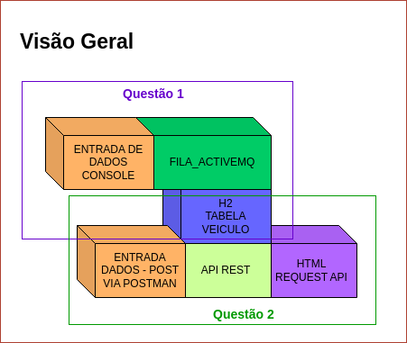

# Práticas Fila de Mensagem e Componentes Spring Web 

# Solução:

 

### Executando solução questão 1:
* Ter H2 instalado no computador
* Executar ActiveMQ
* Executar Produtor.java
* Executar Consumer.java
As verficações podem ser visualizadas diretamente no banco.

### Executando solução questão 2:
* Ter H2 instalado no computador
* Ter Postman instalado no computador
* Execute AppJpaApplication.java
* Abrir Postman e enviar um POST para o endereço localhost:8080/veiculos. O json deve ter a seguinte estrutura:
{"nomeCliente":"string", "marcaModeloVeiculo":"string", "anoModelo":int, "valorVenda":double,"cadastro":"string"};
* Excute pagina "veiculos.html" no seu navegador para ver a tabela completa gravada no banco.

**Alunas: Letícia Borges e Patricia Costa** |
**Curso: Tecnologia em Análise e Desenvolvimentode Sistemas - IFPA - 3º semestre**

